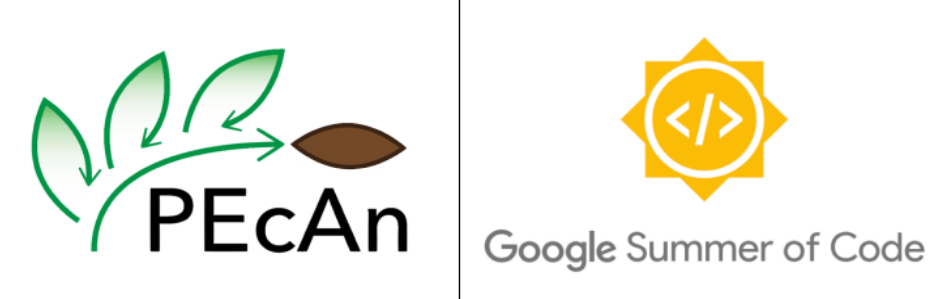

# 
GSoC'23 - PEcAn Project 

### Title : Improving Test Coverage for PEcAn Packages

### Deliverables
1) Improving unit test coverage for PEcAn base packages

2) Adding Integration tests for the following data items:
     + `pecan.data.atmosphere` package
         - `CRUNCEP`
         - `Fluxnet2015`
         - `Ameriflux LBL`
         - `ERA5` 
         - `NOAA GEFS`
        
     + `pecan.data.land` package
         - Accessing the `NEON (National Ecological Observatory Network)` data portal API.
         - Soil Data Access
            1) Spatial Data Access
            2) Tabular Data Access

3) Adding methods and approaches to better unit and intergation testing to the PEcAn Documentation.

Link to Project : [GSoC Project Page](https://summerofcode.withgoogle.com/programs/2023/projects/ozz95eVk)

Please visit the project [Wiki](https://github.com/meetagrawal09/GSoC-23-PEcAn_Project/wiki) for more details.
